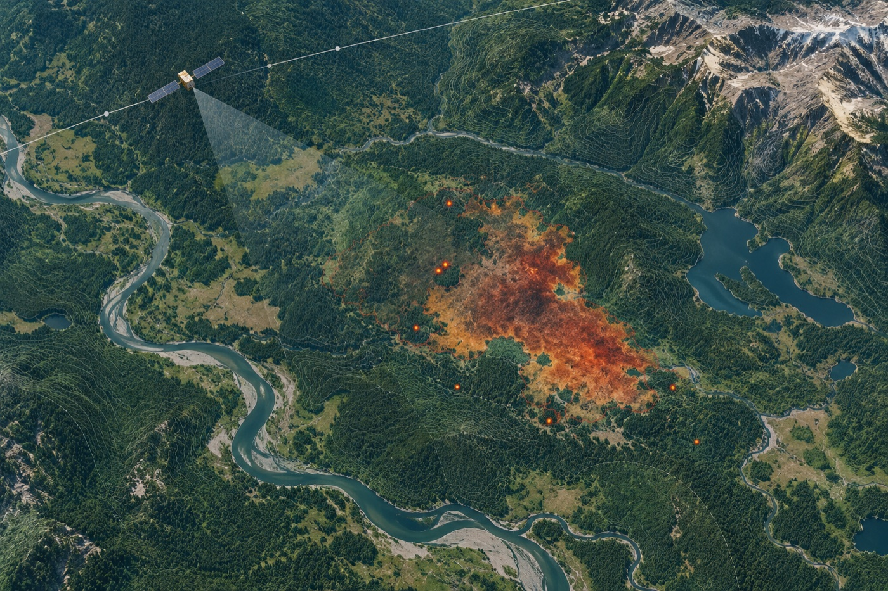

# KosmoFire



> Satellite-based wildfire monitoring with active-fire detection, burned-area mapping, severity classification, and a geospatial API.

This repository contains a remote-sensing and geospatial machine-learning pipeline for analyzing satellite image chips. It combines VIIRS active-fire signals with Sentinel-1 and Sentinel-2 observations to identify thermal hotspots, map burned areas, and classify burn severity. LightGBM models run on CPU; a FastAPI service can expose prepared hotspot and burn products as geospatial data.

## Project status

This source snapshot is **not a complete inference bundle**. It includes the AF (active-fire) LightGBM model, but does not include the BS (burn-severity) model weights, BS metadata and preprocessing file, or `models/bundle.json`. The training and evaluation datasets are also not included. Full AF+BS inference and the bundled service dataset therefore require additional artifacts or model training.

## What it does

- **Active-fire detection (AF):** classifies 256 × 256 VIIRS chips using thermal bands, local background statistics, contextual features, land cover, and auxiliary data.
- **Burned-area and severity mapping (BS):** classifies 512 × 512 chips from before/after Sentinel-2 and Sentinel-1 data into background and severity classes 1–3.
- **Geospatial outputs:** encodes class masks as run-length encoding (RLE), validates submission files, exports hotspots and burn contours, and reports burned area in hectares.
- **Service API:** serves prepared GeoPackage layers through FastAPI as GeoJSON, Shapefile archives, JSON reports, and CSV reports.

## Pipeline

```text
VIIRS + auxiliary data ──> AF features ──> LightGBM ──> active-fire mask
Sentinel-2/1 + auxiliary ─> BS features ──> ordinal LightGBM cascade ──> severity mask (0–3)
prediction masks ──> RLE submission / geospatial exports / FastAPI service
```

The BS model uses three binary classifiers for the ordinal events `severity ≥ 1`, `severity ≥ 2`, and `severity ≥ 3`. Its prediction and cleanup steps are shared through the decision pipeline to keep validation and inference behavior aligned.

## Requirements

- Python 3.12 is the documented environment; the package metadata requires Python 3.11 or newer.
- CPU execution is supported. Training can require substantially more memory and disk than inference, depending on dataset size.
- Dependencies are pinned in `requirements.txt`.

## Installation

```bash
python3.12 -m venv .venv
source .venv/bin/activate
python -m pip install --upgrade pip
python -m pip install -r requirements.txt
```

Optional experiment dependencies (CatBoost, Optuna, SHAP, and the neural-network track) are listed separately:

```bash
python -m pip install -r requirements-extra.txt
```

## Dataset layout

Training and inference data are discovered recursively by raster filename. The supplied chip identifiers and naming convention must be preserved.

```text
data/raw/train/
├── meta.csv
├── af/
│   ├── viirs/AF_tr_000001_VIIRS_I1-I5.tif
│   ├── aux/AF_tr_000001_AUX.tif
│   └── masks/AF_tr_000001_MASK.tif
└── bs/
    ├── sentinel2_pre/BS_tr_000001_Sentinel-2_pre.tif
    ├── sentinel2_post/BS_tr_000001_Sentinel-2_post.tif
    ├── sentinel1_pre/BS_tr_000001_Sentinel-1_pre.tif
    ├── sentinel1_post/BS_tr_000001_Sentinel-1_post.tif
    ├── aux/BS_tr_000001_AUX.tif
    └── masks/BS_tr_000001_MASK.tif
```

The exact directory names may vary; the recognized `.tif` basenames and `meta.csv` fields must match what `kosmofire/chipio.py` and `kosmofire/validation.py` expect. Inference data must include `sample_submission.csv` and the raster chips referenced by that template.

## Training

Place the authorized training data under `data/raw/train`, or pass a different location using `--train-dir`.

```bash
python train_af.py --train-dir data/raw/train
python train_bs.py --train-dir data/raw/train
```

Both commands run grouped cross-validation by default and write models and working artifacts under `models/` and `data/work/`. AF training defaults to 500 boosting rounds; BS training defaults to 400. Use `--help` to see options for folds, feature groups, output paths, and training tags.

When both model families have been trained to the untagged paths expected by inference, build the integrity bundle:

```bash
python make_bundle.py
```

The bundle validates model files, checksums, feature ordering, and LightGBM version at inference time. Do not build it until every model and metadata file required by `kosmofire/bundle.py` exists.

## Local evaluation

Evaluation consumes training labels plus out-of-fold arrays produced during training. Create the output directory first:

```bash
mkdir -p reports
python evaluate_local.py --train-dir data/raw/train --work-dir data/work --model-dir models --af-tag "" --bs-tag ""
```

The empty tags above match the default untagged training commands. If you trained with tags, pass the same tags to evaluation and confirm the corresponding model metadata and OOF files exist. This is a local evaluation workflow; it does not substitute for an external or organizer-provided scorer.

## Inference and submission validation

The inference template must be present under the data directory. Once the complete AF and BS models and a valid bundle have been installed or trained:

```bash
python inference.py \
  --data-dir /path/to/test-data \
  --output outputs/submission.csv \
  --workers 4
```

By default, chip failures stop the run and produce a manifest beside the requested output. `--on-error empty` explicitly allows failed chips to be written as empty masks; inspect the manifest before using such a submission. The program validates row pairs, RLE decoding, chip dimensions, and non-overlapping BS class masks before returning success.

**This command cannot complete with the model files currently included in this snapshot.** Add or train the missing BS weights and metadata, then create `models/bundle.json`.

## Geospatial service

The service reads a prepared GeoPackage. The current builder expects `data/work/af_ids.csv`, `data/work/af_oof_oh.npy`, a `data/work/bs_oof_v2/` OOF directory, and untagged model metadata. Its CLI does not expose tag overrides, so the default training commands above do not create this exact artifact layout. Align the inputs with `kosmofire/service_build.py` before running it:

```bash
python build_service_data.py \
  --train-dir data/raw/train \
  --work-dir data/work \
  --model-dir models \
  --output data/service/fire_service.gpkg
```

Run the API locally:

```bash
python run_service.py --host 127.0.0.1 --port 8000
```

Open `http://127.0.0.1:8000/`. The GeoPackage path can be overridden with `KOSMOFIRE_GPKG`.

| Method | Endpoint | Purpose |
|---|---|---|
| GET | `/api/v1/health` | Service and layer counts |
| GET, POST | `/api/v1/hotspots` | Hotspots filtered by bounding box or polygon and date |
| GET, POST | `/api/v1/burns` | Burn contours with severity and area |
| GET | `/api/v1/burns/export?format=geojson` | GeoJSON export |
| GET | `/api/v1/burns/export?format=shp` | Zipped Shapefile export |
| GET, POST | `/api/v1/report` | Area and severity summary as JSON or CSV |

Example bounding-box query:

```text
http://127.0.0.1:8000/api/v1/hotspots?bbox=west,south,east,north&date_from=2026-01-01&date_to=2026-12-31
```

## Tests

Run the repository test suite from the project root:

```bash
pytest -q
```

Tests cover feature calculations, leakage safeguards, deterministic behavior, ordinal decoding, RLE, submission validation, and service endpoints. Some end-to-end or model-dependent workflows may require datasets or artifacts that are not included in this source snapshot.

## Reproducibility and recommendations

- Keep training, OOF evaluation, and inference feature groups and tags aligned.
- Use the provided grouped validation logic; avoid random chip-level splits that can leak geography or event context across folds.
- Do not use target masks or target-derived information as model features.
- Keep the model files, metadata, preprocessing parameters, feature order, and bundle from the same training run together.
- Review the inference manifest and validate the final CSV before submission or downstream use.
- Keep raw satellite data, generated OOF arrays, GeoPackages, and large outputs outside version control unless there is a clear distribution requirement.

## Repository layout

```text
kosmofire/       Feature engineering, models, training, inference, and service code
tests/           Unit and integration tests
models/          Included model artifacts (AF only in this snapshot)
assets/          README artwork
```

## Search keywords

Satellite wildfire detection, active fire hotspot detection, burned area mapping, burn severity classification, Earth observation, remote sensing, VIIRS fire data, Sentinel-1 SAR, Sentinel-2 multispectral imagery, geospatial machine learning, LightGBM raster classification, RLE segmentation submission, FastAPI geospatial API, GeoJSON wildfire data, GeoPackage fire monitoring.

---

# Русский

> Спутниковый мониторинг природных пожаров: активное горение, картирование гарей, классификация степени повреждения и геопространственный API.

KosmoFire — конвейер дистанционного зондирования Земли и геопространственного машинного обучения. Он объединяет сигналы активного горения VIIRS со снимками Sentinel‑1 и Sentinel‑2, чтобы находить термоточки, выделять контуры гарей и оценивать степень повреждения. Модели LightGBM работают на CPU; FastAPI предоставляет подготовленные геоданные.

## Состояние проекта

Текущий снимок исходников **не содержит полного комплекта для инференса**. В нём есть модель AF для активного горения, но отсутствуют веса BS, метаданные и файл предобработки BS, а также `models/bundle.json`. Обучающего и оценочного набора данных тоже нет. Для полного инференса AF+BS и сборки GeoPackage потребуются дополнительные артефакты или обучение моделей.

## Возможности

- **AF — активное горение:** классификация чипов VIIRS 256 × 256 по тепловым каналам, локальному фону, контекстным признакам, земному покрову и вспомогательным данным.
- **BS — гарь и степень повреждения:** классификация чипов 512 × 512 по снимкам Sentinel‑2 и Sentinel‑1 до и после события; классы 0–3.
- **Геопространственные результаты:** RLE-маски, проверка CSV-посылки, экспорт термоточек и контуров, расчёт площади в гектарах.
- **API:** FastAPI отдаёт GeoJSON, архив Shapefile и отчёты в JSON или CSV из подготовленного GeoPackage.

## Требования и установка

Рекомендуется Python 3.12; в `pyproject.toml` указана совместимость с Python 3.11 и новее. Зависимости закреплены в `requirements.txt`.

```bash
python3.12 -m venv .venv
source .venv/bin/activate
python -m pip install --upgrade pip
python -m pip install -r requirements.txt
```

Дополнительные зависимости для экспериментов:

```bash
python -m pip install -r requirements-extra.txt
```

## Структура данных

Поиск TIFF-файлов выполняется рекурсивно по именам файлов; идентификаторы чипов и шаблоны имён менять нельзя.

```text
data/raw/train/
├── meta.csv
├── af/viirs/AF_tr_000001_VIIRS_I1-I5.tif
├── af/aux/AF_tr_000001_AUX.tif
├── af/masks/AF_tr_000001_MASK.tif
├── bs/sentinel2_pre/BS_tr_000001_Sentinel-2_pre.tif
├── bs/sentinel2_post/BS_tr_000001_Sentinel-2_post.tif
├── bs/sentinel1_pre/BS_tr_000001_Sentinel-1_pre.tif
├── bs/sentinel1_post/BS_tr_000001_Sentinel-1_post.tif
├── bs/aux/BS_tr_000001_AUX.tif
└── bs/masks/BS_tr_000001_MASK.tif
```

Допустимые базовые имена файлов и поля `meta.csv` определяются в `kosmofire/chipio.py` и `kosmofire/validation.py`. Для инференса нужны `sample_submission.csv` и все указанные в нём растровые чипы.

## Обучение и оценка

```bash
python train_af.py --train-dir data/raw/train
python train_bs.py --train-dir data/raw/train
python make_bundle.py
```

По умолчанию обучение выполняет групповую кросс-валидацию: 500 раундов для AF и 400 для BS. Bundle создавайте только после появления всех файлов обеих моделей и их метаданных.

Оценка использует OOF-предсказания и эталонные маски:

```bash
mkdir -p reports
python evaluate_local.py --train-dir data/raw/train --work-dir data/work --model-dir models --af-tag "" --bs-tag ""
```

Пустые теги соответствуют приведённым выше командам обучения без `--tag`. При обучении с тегом укажите его же для оценки и проверьте наличие соответствующих OOF-файлов.

## Инференс

После подготовки полного набора моделей и bundle:

```bash
python inference.py \
  --data-dir /path/to/test-data \
  --output outputs/submission.csv \
  --workers 4
```

Ошибки чипов по умолчанию останавливают обработку и записываются в manifest рядом с CSV. Режим `--on-error empty` явно разрешает пустые маски вместо упавших чипов. Перед использованием результата проверьте manifest и успешный код возврата. Скрипт проверяет пары строк, RLE, размеры чипов и отсутствие пересечения классов BS.

**В текущем архиве команда не выполнит полный инференс:** в нём нет модели BS, её метаданных, предобработки и bundle.

## Геопространственный сервис

Сервис читает подготовленный GeoPackage. Текущий сборщик ожидает `data/work/af_ids.csv`, `data/work/af_oof_oh.npy`, каталог OOF-предсказаний `data/work/bs_oof_v2/` и метаданные моделей без тегов. В CLI нет параметров для тегов, поэтому команды обучения выше не создают такой набор автоматически. Перед запуском согласуйте артефакты с `kosmofire/service_build.py`:

```bash
python build_service_data.py \
  --train-dir data/raw/train \
  --work-dir data/work \
  --model-dir models \
  --output data/service/fire_service.gpkg
```

Запуск API:

```bash
python run_service.py --host 127.0.0.1 --port 8000
```

Откройте `http://127.0.0.1:8000/`. Путь к GeoPackage можно задать переменной `KOSMOFIRE_GPKG`.

| Метод | Путь | Назначение |
|---|---|---|
| GET | `/api/v1/health` | Состояние сервиса и число объектов |
| GET, POST | `/api/v1/hotspots` | Термоточки по bbox или полигону и датам |
| GET, POST | `/api/v1/burns` | Контуры гарей, степень и площадь |
| GET | `/api/v1/burns/export?format=geojson` | Экспорт GeoJSON |
| GET | `/api/v1/burns/export?format=shp` | Архив Shapefile |
| GET, POST | `/api/v1/report` | Сводка по площади и степени в JSON/CSV |

Пример запроса по bbox:

```text
http://127.0.0.1:8000/api/v1/hotspots?bbox=west,south,east,north&date_from=2026-01-01&date_to=2026-12-31
```

## Тесты и рекомендации

```bash
pytest -q
```

Сохраняйте одинаковые признаки и теги между обучением, OOF-оценкой и инференсом. Используйте групповое разбиение по территории и событию, не допускайте попадания эталонных масок и производных от них данных в признаки. Храните вместе веса, метаданные, параметры предобработки, порядок признаков и bundle из одного запуска обучения. Не добавляйте большие спутниковые наборы, OOF-массивы и GeoPackage в Git без необходимости.

## Ключевые слова для поиска

Спутниковое обнаружение пожаров, мониторинг природных пожаров, активные термоточки VIIRS, карта гарей, степень повреждения леса, дистанционное зондирование Земли, Sentinel‑1 SAR, Sentinel‑2, геопространственный ML, классификация спутниковых растров LightGBM, API FastAPI, GeoJSON пожары, GeoPackage.

---

# 中文

> 基于卫星遥感的野火监测：活动火点检测、过火区制图、烧毁严重程度分类与地理空间 API。

KosmoFire 是一个遥感与地理空间机器学习流程，结合 VIIRS 活动火灾观测以及 Sentinel‑1、Sentinel‑2 影像，用于识别热异常、提取过火区并评估烧毁程度。LightGBM 模型可在 CPU 上运行；FastAPI 服务可发布已准备好的地理空间结果。

## 项目状态

当前源码快照**不是完整的推理模型包**。它包含 AF（活动火点）LightGBM 模型，但缺少 BS（过火区严重程度）模型权重、BS 元数据与预处理文件，也缺少 `models/bundle.json`。训练和评估数据同样未包含。因此，完整 AF+BS 推理及 GeoPackage 服务需要补充模型产物或先完成模型训练。

## 功能

- **AF 活动火点检测：**基于 VIIRS 256 × 256 芯片，使用热红外波段、局部背景统计、上下文特征、土地覆盖和辅助数据进行分类。
- **BS 过火区与严重程度制图：**结合事件前后的 Sentinel‑2 和 Sentinel‑1 数据，将 512 × 512 芯片分类为背景及 1–3 级严重程度。
- **地理空间输出：**生成 RLE 掩膜、验证提交 CSV、导出火点与过火区轮廓，并以公顷统计面积。
- **API 服务：**FastAPI 从已准备的 GeoPackage 提供 GeoJSON、Shapefile 压缩包及 JSON/CSV 报告。

## 环境与安装

建议使用 Python 3.12；项目元数据要求 Python 3.11 或更高版本。依赖版本固定在 `requirements.txt` 中。

```bash
python3.12 -m venv .venv
source .venv/bin/activate
python -m pip install --upgrade pip
python -m pip install -r requirements.txt
```

实验功能的可选依赖：

```bash
python -m pip install -r requirements-extra.txt
```

## 数据目录

程序会递归查找 TIFF 文件。芯片 ID 和文件基名必须符合代码中的命名规则。

```text
data/raw/train/
├── meta.csv
├── af/viirs/AF_tr_000001_VIIRS_I1-I5.tif
├── af/aux/AF_tr_000001_AUX.tif
├── af/masks/AF_tr_000001_MASK.tif
├── bs/sentinel2_pre/BS_tr_000001_Sentinel-2_pre.tif
├── bs/sentinel2_post/BS_tr_000001_Sentinel-2_post.tif
├── bs/sentinel1_pre/BS_tr_000001_Sentinel-1_pre.tif
├── bs/sentinel1_post/BS_tr_000001_Sentinel-1_post.tif
├── bs/aux/BS_tr_000001_AUX.tif
└── bs/masks/BS_tr_000001_MASK.tif
```

具体文件名和 `meta.csv` 字段以 `kosmofire/chipio.py` 与 `kosmofire/validation.py` 为准。推理数据目录必须包含 `sample_submission.csv` 及模板中引用的所有栅格芯片。

## 训练与评估

```bash
python train_af.py --train-dir data/raw/train
python train_bs.py --train-dir data/raw/train
python make_bundle.py
```

默认训练执行分组交叉验证：AF 为 500 轮，BS 为 400 轮。只有在两类模型、元数据和预处理文件都齐全后，才能生成完整 bundle。

本地评估需要训练标签和训练阶段生成的 OOF 预测：

```bash
mkdir -p reports
python evaluate_local.py --train-dir data/raw/train --work-dir data/work --model-dir models --af-tag "" --bs-tag ""
```

空标签与上面的默认无标签训练命令匹配。如果训练时使用了标签参数，评估时也必须传入相同标签，并确认对应的 OOF 文件存在。

## 推理与提交验证

准备好完整模型和 bundle 后运行：

```bash
python inference.py \
  --data-dir /path/to/test-data \
  --output outputs/submission.csv \
  --workers 4
```

默认情况下，芯片处理失败会终止运行，并在输出旁生成 manifest。`--on-error empty` 可显式允许将失败芯片写为空掩膜。使用输出前应检查 manifest 和程序退出码。程序会验证提交行、RLE 解码、芯片尺寸以及 BS 类别掩膜是否重叠。

**当前快照缺少 BS 模型、元数据、预处理文件及 bundle，因此无法完成完整推理。**

## 地理空间服务

服务读取预先生成的 GeoPackage。当前构建脚本要求 `data/work/af_ids.csv`、`data/work/af_oof_oh.npy`、`data/work/bs_oof_v2/` OOF 目录以及无标签的模型元数据。CLI 未提供标签覆盖参数，因此上面的默认训练命令不会自动生成这一组文件。运行前请根据 `kosmofire/service_build.py` 对齐所需产物：

```bash
python build_service_data.py \
  --train-dir data/raw/train \
  --work-dir data/work \
  --model-dir models \
  --output data/service/fire_service.gpkg
```

启动 API：

```bash
python run_service.py --host 127.0.0.1 --port 8000
```

访问 `http://127.0.0.1:8000/`。可通过 `KOSMOFIRE_GPKG` 环境变量指定 GeoPackage 路径。

| 方法 | 接口 | 功能 |
|---|---|---|
| GET | `/api/v1/health` | 服务状态和图层数量 |
| GET, POST | `/api/v1/hotspots` | 按 bbox 或多边形及日期筛选火点 |
| GET, POST | `/api/v1/burns` | 过火区轮廓、严重程度与面积 |
| GET | `/api/v1/burns/export?format=geojson` | 导出 GeoJSON |
| GET | `/api/v1/burns/export?format=shp` | 导出 Shapefile 压缩包 |
| GET, POST | `/api/v1/report` | JSON/CSV 面积和严重程度报告 |

bbox 查询示例：

```text
http://127.0.0.1:8000/api/v1/hotspots?bbox=west,south,east,north&date_from=2026-01-01&date_to=2026-12-31
```

## 测试与建议

```bash
pytest -q
```

确保训练、OOF 评估和推理使用一致的特征与标签参数。使用按区域和事件分组的验证，避免标签掩膜及其派生信息进入模型特征。将同一次训练产生的模型权重、元数据、预处理参数、特征顺序和 bundle 一起保存。除非确有分发需求，否则不要把大型卫星数据、OOF 数组和 GeoPackage 提交到 Git。

## 搜索关键词

卫星野火检测、活动火点监测、VIIRS 火灾热点、过火区制图、烧毁严重程度分类、地球观测、遥感、Sentinel‑1 SAR、Sentinel‑2、多光谱影像、地理空间机器学习、LightGBM 栅格分类、FastAPI 地理空间 API、GeoJSON 火灾数据、GeoPackage。
